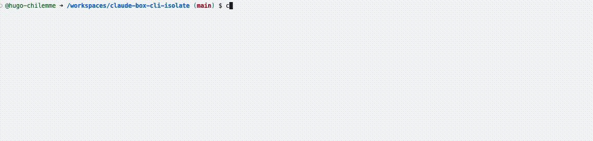

# claude-box



Run Claude Code inside a Docker container, mounting only the files and folders
you choose. Each item is mounted into `/workspace` with its relative path
preserved and live-synced to your machine. Claude only ever sees what you mount.

- `claude-box up <items...>` — mount each item into `/workspace` and start Claude
- `claude-box down` — clean up containers and residual files

Auth is persisted in a Docker volume (`claude-auth`), so you log in once.

---

## Why

On large projects you often want Claude to work on a specific part without
handing it the whole codebase. Pointing Claude Code at the project root exposes
everything: unrelated services, secrets, configuration, other teams' code.

`claude-box` flips that. Instead of opening the project and hoping Claude stays
in its lane, you explicitly list the files and folders it may touch. Everything
else is simply not present in the container, so there is nothing to wander into,
read by accident, or modify. The isolation is structural, not advisory: it comes
from what is mounted, not from instructions Claude is asked to follow.

The result is strict, per-task exposure on big or sensitive repositories, while
edits still apply live to your real files.

---

## Prerequisites

| Requirement | Why | Link |
|-------------|-----|------|
| Docker Desktop (or engine) | runs the container | https://www.docker.com/products/docker-desktop |
| Git | usually already installed | https://git-scm.com/downloads |
| An Anthropic account | for `/login` inside Claude | https://claude.ai |

Docker must be **running** before you run the setup (`docker ps` should respond).

### macOS note
Download and install Docker Desktop from the official site, then launch it and
wait until it is running before continuing:
https://www.docker.com/products/docker-desktop

### Windows note
Docker Desktop requires hardware virtualization. If Windows is itself running
inside a VM (e.g. Parallels/VMware on a Mac), you must enable **nested
virtualization** on the host, VM powered off. This is only possible on Intel
hosts; on Apple Silicon it is generally not supported.

---

## Install — Linux / macOS

Run `./bin/setup.sh` from the same directory as this README.

```bash
chmod +x ./bin/setup.sh
./bin/setup.sh
```

---

## Install — Windows

Run `.\bin\setup.ps1` from the same directory as this README, in PowerShell.

```powershell
powershell -ExecutionPolicy Bypass -File .\bin\setup.ps1
```

---

## Usage

```bash
cd ~/project
claude-box up config.json app/routes
claude-box down
```

Mounting several items preserves their relative paths inside `/workspace`:

```
claude-box up apps/portal services/api config.json

/workspace/
  apps/portal/       -> live-synced with ./apps/portal
  services/api/      -> live-synced with ./services/api
  config.json        -> live-synced with ./config.json
```

Items must exist relative to the directory you run the command from. To mount
something elsewhere, use a relative path (e.g. `claude-box up ../other/api`).

---

## How it works

- Each item is a Docker **bind mount** into `/workspace/<relative-path>`, so
  edits made by Claude apply directly to your real files (live, bidirectional).
- Isolation comes from the container: Claude can only reach the paths you mount.
- `claude-auth` is the only named volume, holding your login between runs.
- On exit, `.claude/` and `CLAUDE.md` injected into the working directory are
  removed automatically.

---

## First run

On the first `claude-box up`, run `/login` inside Claude. The token is stored in
the `claude-auth` volume and reused on later runs.

---

## Notes

- `up` runs the container with `--rm`; it self-destructs when you quit Claude
  (`/exit` or Ctrl+C). `down` is a fallback that also removes stray containers.
- The cleanup step removes `.claude/` and `CLAUDE.md` from the directory you ran
  the command in. If your project already has its own `.claude/` or `CLAUDE.md`,
  back them up first.
